# NoClue - CS3219 Coding Platform Project

Full-stack application with Next.js frontend, NestJS backend, and GraphQL API, deployed on Google Kubernetes Engine (GKE).

## Infrastructure Architecture

```mermaid
graph TB
    subgraph "GitHub"
        GH[GitHub Repository]
        TF_CODE[Terraform Code]
        GA_TF[GitHub Actions<br/>Terraform Workflow]
        GA_DEPLOY[GitHub Actions<br/>Deploy Workflow]
    end

    subgraph "Google Cloud Platform"
        subgraph "Infrastructure (Terraform-managed)"
            VPC[VPC Network]
            NAT[Cloud NAT]
            FW[Firewall Rules]
        end

        subgraph "Container Registry (GCR)"
            GCR_FE[Frontend Image]
            GCR_USER[User Service Image]
            GCR_QUES[Question Service Image]
            GCR_MATCH[Matching Service Image]
            GCR_COLLAB[Collaboration Service Image]
        end

        subgraph "Google Kubernetes Engine"
            subgraph "noclue-app namespace"
                subgraph "Frontend Pods"
                    FE1[Frontend Pod 1]
                    FE2[Frontend Pod 2]
                end

                subgraph "User Service Pods (4001)"
                    US1[User Service Pod 1]
                    US2[User Service Pod 2]
                end

                subgraph "Question Service Pods (4002)"
                    QS1[Question Service Pod 1]
                    QS2[Question Service Pod 2]
                end

                subgraph "Matching Service Pods (4003)"
                    MS1[Matching Service Pod 1]
                    MS2[Matching Service Pod 2]
                end

                subgraph "Collaboration Service Pods (4004)"
                    CS1[Collaboration Service Pod 1]
                    CS2[Collaboration Service Pod 2]
                end

                FE_SVC[Frontend Service<br/>LoadBalancer]
                US_SVC[User Service<br/>LoadBalancer]
                QS_SVC[Question Service<br/>LoadBalancer]
                MS_SVC[Matching Service<br/>LoadBalancer]
                CS_SVC[Collaboration Service<br/>LoadBalancer]

                K8S_SEC[Kubernetes Secrets<br/>Terraform-managed]
            end
        end
    end

    subgraph "External Services"
        SB[(Supabase Database)]
    end

    USER[User Browser]

    GH -->|Contains| TF_CODE
    TF_CODE -->|Triggers| GA_TF
    GA_TF -->|Provisions| VPC
    GA_TF -->|Provisions| NAT
    GA_TF -->|Provisions| FW
    GA_TF -->|Creates| GKE
    GA_TF -->|Creates| K8S_SEC

    GH -->|Push code| GA_DEPLOY
    GA_DEPLOY -->|Build & Push| GCR_FE
    GA_DEPLOY -->|Build & Push| GCR_USER
    GA_DEPLOY -->|Build & Push| GCR_QUES
    GA_DEPLOY -->|Build & Push| GCR_MATCH
    GA_DEPLOY -->|Build & Push| GCR_COLLAB

    GCR_FE -->|Deploy| FE1
    GCR_FE -->|Deploy| FE2
    GCR_USER -->|Deploy| US1
    GCR_USER -->|Deploy| US2
    GCR_QUES -->|Deploy| QS1
    GCR_QUES -->|Deploy| QS2
    GCR_MATCH -->|Deploy| MS1
    GCR_MATCH -->|Deploy| MS2
    GCR_COLLAB -->|Deploy| CS1
    GCR_COLLAB -->|Deploy| CS2

    USER -->|HTTPS| FE_SVC
    FE_SVC --> FE1
    FE_SVC --> FE2

    FE1 -->|GraphQL| US_SVC
    FE1 -->|GraphQL| QS_SVC
    FE1 -->|GraphQL| MS_SVC
    FE1 -->|GraphQL| CS_SVC
    FE2 -->|GraphQL| US_SVC
    FE2 -->|GraphQL| QS_SVC
    FE2 -->|GraphQL| MS_SVC
    FE2 -->|GraphQL| CS_SVC

    US_SVC --> US1
    US_SVC --> US2
    QS_SVC --> QS1
    QS_SVC --> QS2
    MS_SVC --> MS1
    MS_SVC --> MS2
    CS_SVC --> CS1
    CS_SVC --> CS2

    US1 -.->|Read Secrets| K8S_SEC
    US2 -.->|Read Secrets| K8S_SEC
    QS1 -.->|Read Secrets| K8S_SEC
    QS2 -.->|Read Secrets| K8S_SEC
    MS1 -.->|Read Secrets| K8S_SEC
    MS2 -.->|Read Secrets| K8S_SEC
    CS1 -.->|Read Secrets| K8S_SEC
    CS2 -.->|Read Secrets| K8S_SEC

    US1 -->|Query| SB
    US2 -->|Query| SB
    QS1 -->|Query| SB
    QS2 -->|Query| SB
    MS1 -->|Query| SB
    MS2 -->|Query| SB
    CS1 -->|Query| SB
    CS2 -->|Query| SB

    MS1 -->|HTTP| US_SVC
    MS1 -->|HTTP| QS_SVC
    MS2 -->|HTTP| US_SVC
    MS2 -->|HTTP| QS_SVC
    CS1 -->|HTTP| MS_SVC
    CS2 -->|HTTP| MS_SVC

    style USER fill:#e1f5ff
    style SB fill:#ffe1e1
    style GH fill:#f0f0f0
    style GA_TF fill:#90EE90
    style GA_DEPLOY fill:#90EE90
    style GCR_FE fill:#FFE4B5
    style GCR_USER fill:#FFE4B5
    style GCR_QUES fill:#FFE4B5
    style GCR_MATCH fill:#FFE4B5
    style GCR_COLLAB fill:#FFE4B5
    style TF_CODE fill:#DDA0DD
    style VPC fill:#F0E68C
    style NAT fill:#F0E68C
    style FW fill:#F0E68C
```



## Tech Stack

### Frontend
- **Framework**: Next.js 14 (React 18)
- **Language**: TypeScript
- **GraphQL Client**: Apollo Client
- **Styling**: CSS (customizable)

### Backend (Microservices)
- **Framework**: NestJS
- **Language**: TypeScript
- **GraphQL Server**: Apollo Server (Federated)
- **Database**: Supabase (PostgreSQL)
- **Services**:
  - User Service (Port 4001) - Authentication & user management
  - Question Service (Port 4002) - Coding problems & questions
  - Matching Service (Port 4003) - User matching with WebSocket
  - Collaboration Service (Port 4004) - Real-time collaboration with WebSocket

### Shared
- **GraphQL Schema**: Shared type definitions in `common/` package

### Infrastructure
- **IaC Tool**: Terraform
- **Container Registry**: Google Container Registry (GCR)
- **Orchestration**: Google Kubernetes Engine (GKE)
- **CI/CD**: GitHub Actions
- **Deployment**: Automated on push to `main` branch

## Project Structure

```
noclue/
├── frontend/                 # Next.js frontend application
│   ├── src/
│   │   ├── app/             # Next.js 14 app directory
│   │   ├── lib/             # Apollo Client configuration
│   │   └── components/      # React components
│   ├── package.json
│   ├── tsconfig.json
│   └── next.config.js
│
├── backend/                  # Microservices backend
│   ├── services/
│   │   ├── user-service/    # User service (Port 4001)
│   │   │   ├── src/
│   │   │   ├── package.json
│   │   │   └── tsconfig.json
│   │   ├── question-service/ # Question service (Port 4002)
│   │   │   ├── src/
│   │   │   ├── package.json
│   │   │   └── tsconfig.json
│   │   ├── matching-service/ # Matching service (Port 4003)
│   │   │   ├── src/
│   │   │   ├── package.json
│   │   │   └── tsconfig.json
│   │   └── collaboration-service/ # Collaboration service (Port 4004)
│   │       ├── src/
│   │       ├── package.json
│   │       └── tsconfig.json
│   ├── shared/              # Shared utilities (optional)
│   ├── package.json         # Workspace config
│   └── MICROSERVICES.md     # Architecture docs
│
├── common/                   # Shared GraphQL schema and types
│   ├── src/
│   │   ├── schema.graphql   # GraphQL schema definition
│   │   └── index.ts         # TypeScript types
│   ├── package.json
│   └── tsconfig.json
│
├── k8s/                      # Kubernetes manifests
│   ├── frontend-deployment.yaml
│   ├── frontend-service.yaml
│   ├── secrets.yaml.example
│   └── (microservice k8s manifests to be created)
│
├── terraform/                # Infrastructure as Code (Terraform)
│   ├── main.tf              # Provider and API configuration
│   ├── variables.tf         # Input variables
│   ├── outputs.tf           # Output values
│   ├── gke.tf              # GKE cluster configuration
│   ├── network.tf          # VPC and networking
│   ├── iam.tf              # Service accounts and IAM
│   ├── kubernetes.tf       # Kubernetes resources
│   └── terraform.tfvars.example
│
├── .github/
│   └── workflows/
│       ├── deploy.yml       # Application deployment pipeline
│       └── terraform.yml    # Infrastructure provisioning pipeline
│
├── Dockerfile.frontend              # Frontend Docker image
├── Dockerfile.user-service          # User service Docker image
├── Dockerfile.question-service      # Question service Docker image
├── Dockerfile.matching-service      # Matching service Docker image
├── Dockerfile.collaboration-service # Collaboration service Docker image
├── package.json                     # Root package.json (monorepo)
└── README.md
```

## Getting Started

### Prerequisites

- Node.js 20.11+ and npm 9+ (or Node.js 18+ with some dev dependency warnings)
- Docker (for containerization)
- Google Cloud SDK (for GKE deployment)
- Supabase account and project

### Local Development

1. **Clone the repository**
   ```bash
   git clone <repository-url>
   cd noclue
   ```

2. **Install dependencies**
   ```bash
   npm install
   ```

3. **Set up environment variables**

   Frontend (`frontend/.env.local`):
   ```env
   NEXT_PUBLIC_GRAPHQL_URL=http://localhost:4001/graphql
   ```

   Each Backend Service (`.env` in each service folder):
   ```env
   # User Service - Port 4001
   PORT=4001
   CORS_ORIGIN=http://localhost:3000
   SUPABASE_URL=your_supabase_url
   SUPABASE_KEY=your_supabase_anon_key

   # Question Service - Port 4002
   # Matching Service - Port 4003 (+ USER_SERVICE_URL, QUESTION_SERVICE_URL)
   # Collaboration Service - Port 4004 (+ MATCHING_SERVICE_URL)
   ```

4. **Build the common package**
   ```bash
   npm run build:common
   ```

5. **Complete microservices setup** (if not done)
   ```bash
   cd backend
   chmod +x setup-services.sh
   ./setup-services.sh
   npm run install:services
   ```

6. **Run development servers**
   ```bash
   # Run frontend and all backend services
   npm run dev

   # Or run individually
   npm run dev:frontend        # Port 3000

   # Backend services
   cd backend
   npm run dev:user            # Port 4001
   npm run dev:question        # Port 4002
   npm run dev:matching        # Port 4003
   npm run dev:collaboration   # Port 4004
   # Or all at once
   npm run dev:services
   ```

7. **Access the application**
   - Frontend: http://localhost:3000
   - User Service GraphQL: http://localhost:4001/graphql
   - Question Service GraphQL: http://localhost:4002/graphql
   - Matching Service GraphQL: http://localhost:4003/graphql
   - Collaboration Service GraphQL: http://localhost:4004/graphql

### Building for Production

```bash
# Build all packages
npm run build

# Build individually
npm run build:common
npm run build:frontend

# Build backend services
cd backend
npm run build:services
# Or individually
npm run build:user
npm run build:question
npm run build:matching
npm run build:collaboration
```

## Infrastructure Provisioning with Terraform

### Why Terraform?

This project uses Terraform to manage all GCP infrastructure as code, providing:
- **Reproducibility**: Recreate entire infrastructure with one command
- **Version Control**: Track infrastructure changes in git
- **Automation**: Integrate with CI/CD pipelines
- **Documentation**: Infrastructure defined as code serves as documentation

### Terraform Quick Start

1. **Install Terraform**
   ```bash
   # macOS
   brew install terraform

   # Or download from https://www.terraform.io/downloads
   ```

2. **Configure Terraform Variables**
   ```bash
   cd terraform
   cp terraform.tfvars.example terraform.tfvars
   # Edit terraform.tfvars with your values
   ```

3. **Provision Infrastructure**
   ```bash
   # Initialize Terraform
   terraform init

   # Preview changes
   terraform plan

   # Apply changes
   terraform apply
   ```

4. **Get kubectl credentials**
   ```bash
   # Output from Terraform shows the command
   gcloud container clusters get-credentials noclue-cluster --zone us-central1-a --project your-project-id
   ```

**Documentation:**
- Quick Start: [TERRAFORM_QUICK_START.md](TERRAFORM_QUICK_START.md) - Get running in 5 minutes
- Full Guide: [DEPLOYMENT.md](DEPLOYMENT.md) - Complete deployment walkthrough
- Terraform Details: [terraform/README.md](terraform/README.md) - In-depth Terraform documentation

### Terraform-Managed Resources

Terraform provisions:
- ✅ VPC Network with custom subnets
- ✅ GKE Cluster with autoscaling node pools
- ✅ Service Accounts with IAM permissions
- ✅ Firewall rules and Cloud NAT
- ✅ Kubernetes namespaces and secrets

## Deployment

### Prerequisites for Deployment

1. **Infrastructure Provisioned**
   - Run Terraform to create GKE cluster (see above)
   - Or manually create a GCP project and GKE cluster

2. **GitHub Secrets Configuration**

   Add the following secrets to your GitHub repository (`Settings > Secrets and variables > Actions`):

   | Secret Name | Description | Required For |
   |-------------|-------------|--------------|
   | `GCP_PROJECT_ID` | Your GCP project ID | Terraform & Deploy |
   | `GCP_SA_KEY` | Service account JSON key | Terraform & Deploy |
   | `GKE_CLUSTER` | Name of your GKE cluster (default: `noclue-cluster`) | Deploy |
   | `GKE_ZONE` | Zone for GKE cluster (default: `us-central1-a`) | Deploy & Terraform |
   | `GCP_REGION` | GCP region (default: `us-central1`) | Terraform |
   | `SUPABASE_URL` | Your Supabase project URL | Terraform & Deploy |
   | `SUPABASE_KEY` | Your Supabase anon/public key | Terraform & Deploy |

3. **Service Account Permissions**

   Your GCP service account needs the following roles:
   - **For Deployment**: `roles/container.developer`, `roles/storage.admin`
   - **For Terraform**: `roles/compute.admin`, `roles/container.admin`, `roles/iam.serviceAccountAdmin`

### Automated Workflows

This project has two GitHub Actions workflows:

#### 1. Terraform Infrastructure Workflow (`.github/workflows/terraform.yml`)

Manages infrastructure provisioning. Triggered by:
- Push to `main` with changes to `terraform/**` (runs `terraform plan`)
- Manual workflow dispatch with action choice: `plan`, `apply`, or `destroy`

**To provision infrastructure via GitHub Actions:**
```bash
# Go to GitHub > Actions > Terraform Infrastructure > Run workflow
# Select 'apply' and run
```

#### 2. Application Deployment Workflow (`.github/workflows/deploy.yml`)

Deploys application to GKE. Triggered automatically on push to `main`:

```bash
git add .
git commit -m "Deploy application"
git push origin main
```

The deployment pipeline:
1. Builds the common package
2. Runs tests (if available)
3. Builds Docker images for frontend and all 4 microservices
4. Pushes images to Google Container Registry (GCR)
5. Deploys to GKE cluster (namespace: `noclue-app`)
6. Outputs all service URLs (Frontend + 4 backend services)

### Manual Deployment

1. **Build and push Docker images**
   ```bash
   # Authenticate with GCR
   gcloud auth configure-docker

   # Build and push all services
   docker build -f Dockerfile.frontend -t gcr.io/YOUR_PROJECT_ID/frontend:latest .
   docker push gcr.io/YOUR_PROJECT_ID/frontend:latest

   docker build -f Dockerfile.user-service -t gcr.io/YOUR_PROJECT_ID/user-service:latest .
   docker push gcr.io/YOUR_PROJECT_ID/user-service:latest

   docker build -f Dockerfile.question-service -t gcr.io/YOUR_PROJECT_ID/question-service:latest .
   docker push gcr.io/YOUR_PROJECT_ID/question-service:latest

   docker build -f Dockerfile.matching-service -t gcr.io/YOUR_PROJECT_ID/matching-service:latest .
   docker push gcr.io/YOUR_PROJECT_ID/matching-service:latest

   docker build -f Dockerfile.collaboration-service -t gcr.io/YOUR_PROJECT_ID/collaboration-service:latest .
   docker push gcr.io/YOUR_PROJECT_ID/collaboration-service:latest
   ```

2. **Get GKE credentials**
   ```bash
   gcloud container clusters get-credentials YOUR_CLUSTER_NAME --zone YOUR_ZONE
   ```

3. **Kubernetes secrets are managed by Terraform**
   If you need to update secrets manually:
   ```bash
   kubectl create secret generic app-secrets \
     --from-literal=supabase-url=YOUR_SUPABASE_URL \
     --from-literal=supabase-key=YOUR_SUPABASE_KEY \
     -n noclue-app
   ```

4. **Deploy to Kubernetes**
   ```bash
   # Deploy frontend
   kubectl apply -f k8s/frontend-deployment.yaml -n noclue-app
   kubectl apply -f k8s/frontend-service.yaml -n noclue-app

   # Deploy microservices (manifests need to be created)
   # See backend/MICROSERVICES.md for service setup
   ```

5. **Get service URLs**
   ```bash
   kubectl get services -n noclue-app
   ```

## Supabase Database Setup

Create a `users` table in your Supabase project:

```sql
CREATE TABLE users (
  id UUID DEFAULT gen_random_uuid() PRIMARY KEY,
  email VARCHAR(255) UNIQUE NOT NULL,
  name VARCHAR(255) NOT NULL,
  created_at TIMESTAMP WITH TIME ZONE DEFAULT CURRENT_TIMESTAMP,
  updated_at TIMESTAMP WITH TIME ZONE DEFAULT CURRENT_TIMESTAMP
);

-- Enable Row Level Security (optional)
ALTER TABLE users ENABLE ROW LEVEL SECURITY;

-- Create updated_at trigger
CREATE OR REPLACE FUNCTION update_updated_at_column()
RETURNS TRIGGER AS $$
BEGIN
  NEW.updated_at = CURRENT_TIMESTAMP;
  RETURN NEW;
END;
$$ language 'plpgsql';

CREATE TRIGGER update_users_updated_at BEFORE UPDATE ON users
  FOR EACH ROW EXECUTE FUNCTION update_updated_at_column();
```

## GraphQL API

### Example Queries

```graphql
# Get all users
query GetUsers {
  users {
    id
    email
    name
    createdAt
  }
}

# Get a specific user
query GetUser {
  user(id: "user-id-here") {
    id
    email
    name
  }
}
```

### Example Mutations

```graphql
# Create a user
mutation CreateUser {
  createUser(input: {
    email: "user@example.com"
    name: "John Doe"
  }) {
    id
    email
    name
  }
}

# Update a user
mutation UpdateUser {
  updateUser(
    id: "user-id-here"
    input: {
      name: "Jane Doe"
    }
  ) {
    id
    name
  }
}

# Delete a user
mutation DeleteUser {
  deleteUser(id: "user-id-here")
}
```

## Extending the Application

### Adding New GraphQL Types

1. Update the schema in `common/src/schema.graphql`
2. Add corresponding TypeScript types in `common/src/index.ts`
3. Rebuild the common package: `npm run build:common`
4. Create resolvers in the backend
5. Use the types in the frontend

### Adding New Modules

**Backend:**
```bash
cd backend
nest generate module moduleName
nest generate service moduleName
nest generate resolver moduleName
```

**Frontend:**
Create new components in `frontend/src/components/`

## Monitoring and Debugging

### View Kubernetes Pods
```bash
kubectl get pods
```

### View Pod Logs
```bash
kubectl logs -f <pod-name>
```

### View Services
```bash
kubectl get services
```

### Scale Deployments
```bash
kubectl scale deployment frontend --replicas=3 -n noclue-app
kubectl scale deployment user-service --replicas=3 -n noclue-app
kubectl scale deployment question-service --replicas=3 -n noclue-app
kubectl scale deployment matching-service --replicas=3 -n noclue-app
kubectl scale deployment collaboration-service --replicas=3 -n noclue-app
```

## Troubleshooting

### Frontend can't connect to backend
- Check that `NEXT_PUBLIC_GRAPHQL_URL` points to the correct backend service URL
- Verify CORS settings in each service's `main.ts` file

### Backend can't connect to Supabase
- Verify `SUPABASE_URL` and `SUPABASE_KEY` environment variables
- Check Kubernetes secrets: `kubectl get secret app-secrets -o yaml`

### Docker build fails
- Ensure all dependencies are installed
- Check that the common package builds successfully first
- Verify file paths in Dockerfiles

### GKE deployment fails
- Verify GCP credentials and permissions
- Check GitHub Actions logs for specific errors
- Ensure cluster has sufficient resources

## License

MIT

## Contributors

CS3219 Project Team
