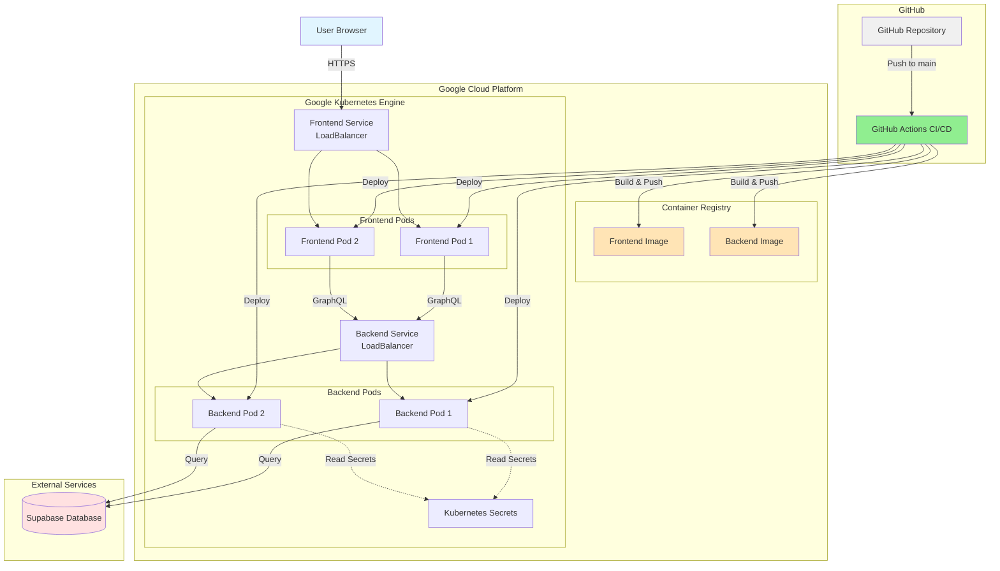

# NoClue - CS3219 Coding Platform Project

Full-stack application with Next.js frontend, NestJS backend, and GraphQL API, deployed on Google Kubernetes Engine (GKE).

## Infrastructure Architecture



## Tech Stack

### Frontend
- **Framework**: Next.js 14 (React 18)
- **Language**: TypeScript
- **GraphQL Client**: Apollo Client
- **Styling**: CSS (customizable)

### Backend
- **Framework**: NestJS
- **Language**: TypeScript
- **GraphQL Server**: Apollo Server
- **Database**: Supabase (PostgreSQL)

### Shared
- **GraphQL Schema**: Shared type definitions in `common/` package

### Infrastructure
- **Container Registry**: Google Container Registry (GCR)
- **Orchestration**: Google Kubernetes Engine (GKE)
- **CI/CD**: GitHub Actions
- **Deployment**: Automated on push to `main` branch

## Project Structure

```
noclue/
├── frontend/                 # Next.js frontend application
│   ├── src/
│   │   ├── app/             # Next.js 14 app directory
│   │   ├── lib/             # Apollo Client configuration
│   │   └── components/      # React components
│   ├── package.json
│   ├── tsconfig.json
│   └── next.config.js
│
├── backend/                  # NestJS backend application
│   ├── src/
│   │   ├── users/           # Users module (example)
│   │   ├── config/          # Supabase configuration
│   │   ├── app.module.ts    # Root module
│   │   └── main.ts          # Application entry point
│   ├── package.json
│   ├── tsconfig.json
│   └── nest-cli.json
│
├── common/                   # Shared GraphQL schema and types
│   ├── src/
│   │   ├── schema.graphql   # GraphQL schema definition
│   │   └── index.ts         # TypeScript types
│   ├── package.json
│   └── tsconfig.json
│
├── k8s/                      # Kubernetes manifests
│   ├── backend-deployment.yaml
│   ├── backend-service.yaml
│   ├── frontend-deployment.yaml
│   ├── frontend-service.yaml
│   └── secrets.yaml.example
│
├── .github/
│   └── workflows/
│       └── deploy.yml        # CI/CD pipeline
│
├── Dockerfile.frontend       # Frontend Docker image
├── Dockerfile.backend        # Backend Docker image
├── package.json              # Root package.json (monorepo)
└── README.md
```

## Getting Started

### Prerequisites

- Node.js 18+ and npm 9+
- Docker (for containerization)
- Google Cloud SDK (for GKE deployment)
- Supabase account and project

### Local Development

1. **Clone the repository**
   ```bash
   git clone <repository-url>
   cd noclue
   ```

2. **Install dependencies**
   ```bash
   npm install
   ```

3. **Set up environment variables**

   Frontend (`frontend/.env.local`):
   ```env
   NEXT_PUBLIC_GRAPHQL_URL=http://localhost:4000/graphql
   ```

   Backend (`backend/.env`):
   ```env
   PORT=4000
   CORS_ORIGIN=http://localhost:3000
   SUPABASE_URL=your_supabase_url
   SUPABASE_KEY=your_supabase_anon_key
   ```

4. **Build the common package**
   ```bash
   npm run build:common
   ```

5. **Run development servers**
   ```bash
   # Run both frontend and backend concurrently
   npm run dev

   # Or run individually
   npm run dev:frontend
   npm run dev:backend
   ```

6. **Access the application**
   - Frontend: http://localhost:3000
   - Backend GraphQL Playground: http://localhost:4000/graphql

### Building for Production

```bash
# Build all packages
npm run build

# Build individually
npm run build:common
npm run build:frontend
npm run build:backend
```

## Deployment

### Prerequisites for GKE Deployment

1. **GCP Project Setup**
   - Create a GCP project
   - Enable Kubernetes Engine API
   - Enable Container Registry API
   - Create a GKE cluster

2. **GitHub Secrets Configuration**

   Add the following secrets to your GitHub repository (`Settings > Secrets and variables > Actions`):

   | Secret Name | Description |
   |-------------|-------------|
   | `GCP_PROJECT_ID` | Your GCP project ID |
   | `GCP_SA_KEY` | Service account JSON key with GKE and GCR permissions |
   | `GKE_CLUSTER` | Name of your GKE cluster |
   | `GKE_ZONE` | Zone where your GKE cluster is located (e.g., `us-central1-a`) |
   | `SUPABASE_URL` | Your Supabase project URL |
   | `SUPABASE_KEY` | Your Supabase anon/public key |

3. **Service Account Permissions**

   Your GCP service account needs the following roles:
   - Kubernetes Engine Developer
   - Storage Admin (for GCR)
   - Service Account User

### Automated Deployment

The application automatically deploys to GKE when you push to the `main` branch:

```bash
git add .
git commit -m "Deploy to GKE"
git push origin main
```

The CI/CD pipeline will:
1. Build the common package
2. Run tests (if available)
3. Build Docker images for frontend and backend
4. Push images to Google Container Registry
5. Deploy to GKE cluster
6. Output the service URLs

### Manual Deployment

1. **Build and push Docker images**
   ```bash
   # Authenticate with GCR
   gcloud auth configure-docker

   # Build and push backend
   docker build -f Dockerfile.backend -t gcr.io/YOUR_PROJECT_ID/backend:latest .
   docker push gcr.io/YOUR_PROJECT_ID/backend:latest

   # Build and push frontend
   docker build -f Dockerfile.frontend -t gcr.io/YOUR_PROJECT_ID/frontend:latest .
   docker push gcr.io/YOUR_PROJECT_ID/frontend:latest
   ```

2. **Get GKE credentials**
   ```bash
   gcloud container clusters get-credentials YOUR_CLUSTER_NAME --zone YOUR_ZONE
   ```

3. **Create Kubernetes secrets**
   ```bash
   kubectl create secret generic app-secrets \
     --from-literal=supabase-url=YOUR_SUPABASE_URL \
     --from-literal=supabase-key=YOUR_SUPABASE_KEY
   ```

4. **Deploy to Kubernetes**
   ```bash
   # Update the image tags in deployment files
   sed -i "s|gcr.io/PROJECT_ID/backend:TAG|gcr.io/YOUR_PROJECT_ID/backend:latest|g" k8s/backend-deployment.yaml
   sed -i "s|gcr.io/PROJECT_ID/frontend:TAG|gcr.io/YOUR_PROJECT_ID/frontend:latest|g" k8s/frontend-deployment.yaml

   # Apply manifests
   kubectl apply -f k8s/backend-deployment.yaml
   kubectl apply -f k8s/backend-service.yaml
   kubectl apply -f k8s/frontend-deployment.yaml
   kubectl apply -f k8s/frontend-service.yaml
   ```

5. **Get service URLs**
   ```bash
   kubectl get services
   ```

## Supabase Database Setup

Create a `users` table in your Supabase project:

```sql
CREATE TABLE users (
  id UUID DEFAULT gen_random_uuid() PRIMARY KEY,
  email VARCHAR(255) UNIQUE NOT NULL,
  name VARCHAR(255) NOT NULL,
  created_at TIMESTAMP WITH TIME ZONE DEFAULT CURRENT_TIMESTAMP,
  updated_at TIMESTAMP WITH TIME ZONE DEFAULT CURRENT_TIMESTAMP
);

-- Enable Row Level Security (optional)
ALTER TABLE users ENABLE ROW LEVEL SECURITY;

-- Create updated_at trigger
CREATE OR REPLACE FUNCTION update_updated_at_column()
RETURNS TRIGGER AS $$
BEGIN
  NEW.updated_at = CURRENT_TIMESTAMP;
  RETURN NEW;
END;
$$ language 'plpgsql';

CREATE TRIGGER update_users_updated_at BEFORE UPDATE ON users
  FOR EACH ROW EXECUTE FUNCTION update_updated_at_column();
```

## GraphQL API

### Example Queries

```graphql
# Get all users
query GetUsers {
  users {
    id
    email
    name
    createdAt
  }
}

# Get a specific user
query GetUser {
  user(id: "user-id-here") {
    id
    email
    name
  }
}
```

### Example Mutations

```graphql
# Create a user
mutation CreateUser {
  createUser(input: {
    email: "user@example.com"
    name: "John Doe"
  }) {
    id
    email
    name
  }
}

# Update a user
mutation UpdateUser {
  updateUser(
    id: "user-id-here"
    input: {
      name: "Jane Doe"
    }
  ) {
    id
    name
  }
}

# Delete a user
mutation DeleteUser {
  deleteUser(id: "user-id-here")
}
```

## Extending the Application

### Adding New GraphQL Types

1. Update the schema in `common/src/schema.graphql`
2. Add corresponding TypeScript types in `common/src/index.ts`
3. Rebuild the common package: `npm run build:common`
4. Create resolvers in the backend
5. Use the types in the frontend

### Adding New Modules

**Backend:**
```bash
cd backend
nest generate module moduleName
nest generate service moduleName
nest generate resolver moduleName
```

**Frontend:**
Create new components in `frontend/src/components/`

## Monitoring and Debugging

### View Kubernetes Pods
```bash
kubectl get pods
```

### View Pod Logs
```bash
kubectl logs -f <pod-name>
```

### View Services
```bash
kubectl get services
```

### Scale Deployments
```bash
kubectl scale deployment frontend --replicas=3
kubectl scale deployment backend --replicas=3
```

## Troubleshooting

### Frontend can't connect to backend
- Check that `NEXT_PUBLIC_GRAPHQL_URL` points to the correct backend service URL
- Verify CORS settings in `backend/src/main.ts`

### Backend can't connect to Supabase
- Verify `SUPABASE_URL` and `SUPABASE_KEY` environment variables
- Check Kubernetes secrets: `kubectl get secret app-secrets -o yaml`

### Docker build fails
- Ensure all dependencies are installed
- Check that the common package builds successfully first
- Verify file paths in Dockerfiles

### GKE deployment fails
- Verify GCP credentials and permissions
- Check GitHub Actions logs for specific errors
- Ensure cluster has sufficient resources

## License

MIT

## Contributors

CS3219 Project Team
