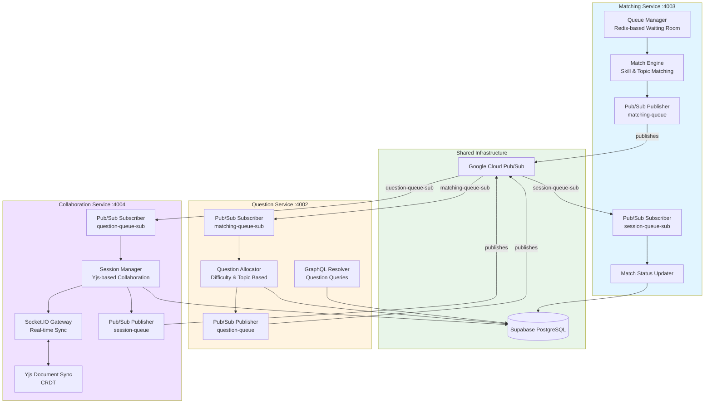

# NoClue - CS3219 Coding Platform

Microservices-based coding platform with Next.js frontend and NestJS backend, deployed on Google Kubernetes Engine (GKE).

## Quick Links

- [Setup Guide](./docs/SETUP.md) - First-time deployment and local development
- [Pub/Sub Integration](./docs/PUBSUB_INTEGRATION.md) - Microservices messaging architecture
- [Troubleshooting](./docs/TROUBLESHOOTING.md) - Debug common issues
- [Disaster Recovery](./docs/DISASTER_RECOVERY.md) - Emergency procedures and backups

## Architecture Overview

### System Architecture

```
┌─────────────────────────────────────────────────────┐
│                  User Browser                        │
└───────────────────┬─────────────────────────────────┘
                    │ HTTPS
                    ▼
┌─────────────────────────────────────────────────────┐
│              Google Kubernetes Engine                │
│  ┌─────────────────────────────────────────────┐   │
│  │         noclue-app namespace                 │   │
│  │                                               │   │
│  │  ┌──────────┐  ┌──────────┐  ┌──────────┐  │   │
│  │  │ Frontend │  │   User   │  │ Question │  │   │
│  │  │  (Next)  │  │ Service  │  │ Service  │  │   │
│  │  │ Port 3000│  │ Port 4001│  │ Port 4002│  │   │
│  │  └──────────┘  └──────────┘  └──────────┘  │   │
│  │       │             │              │         │   │
│  │  ┌────┴─────┐  ┌───┴──────┐               │   │
│  │  │ Matching │  │ Collab   │                │   │
│  │  │ Service  │  │ Service  │                │   │
│  │  │ Port 4003│  │ Port 4004│                │   │
│  │  └──────────┘  └──────────┘                │   │
│  │       │              │                       │   │
│  │       └──────┬───────┘                       │   │
│  │              ▼                                │   │
│  │      K8s Secrets (Supabase credentials)     │   │
│  └─────────────────────────────────────────────┘   │
└───────────────────┬─────────────────────────────────┘
                    │
          ┌─────────┴──────────┐
          │                    │
          ▼                    ▼
┌────────────────────┐  ┌────────────────────┐
│  Supabase Cloud    │  │ Google Cloud       │
│  PostgreSQL + Auth │  │ Pub/Sub            │
└────────────────────┘  └────────────────────┘

CI/CD: GitHub Actions → Build → GCR → Deploy to GKE
```

### Microservices Communication Flow



**Message Flow:**
1. **Match Found** → Matching Service publishes to `matching-queue`
2. **Question Assignment** → Question Service receives match, assigns question, publishes to `question-queue`
3. **Session Start** → Collaboration Service receives question, provisions session
4. **Session End** → Collaboration Service publishes to `session-queue`
5. **Match Complete** → Matching Service receives session end, updates match status

For detailed Pub/Sub integration, see [Pub/Sub Integration Guide](./docs/PUBSUB_INTEGRATION.md).

## Tech Stack

### Frontend
- **Framework**: Next.js 14 (React 18)
- **Language**: TypeScript
- **GraphQL Client**: Apollo Client
- **Styling**: CSS (customizable)

### Backend (Microservices)
- **Framework**: NestJS
- **Language**: TypeScript
- **GraphQL Server**: Apollo Server (Federated)
- **Database**: Supabase (PostgreSQL)
- **Message Queue**: Google Cloud Pub/Sub
- **Services**:
  - User Service (Port 4001) - Authentication & user management
  - Question Service (Port 4002) - Coding problems & questions
  - Matching Service (Port 4003) - User matching with WebSocket
  - Collaboration Service (Port 4004) - Real-time collaboration with WebSocket & Yjs

### Shared
- **GraphQL Schema**: Shared type definitions in `common/` package
- **Pub/Sub Module**: Reusable messaging service with TypeScript types

### Infrastructure
- **Orchestration**: Google Kubernetes Engine (GKE)
- **Container Registry**: Google Container Registry (GCR)
- **Messaging**: Google Cloud Pub/Sub (asynchronous inter-service communication)
- **CI/CD**: GitHub Actions (automated on push to `main`)
- **Secrets**: Kubernetes Secrets

## Project Structure

```
noclue/
├── frontend/                 # Next.js frontend application
│   ├── src/
│   │   ├── app/             # Next.js 14 app directory
│   │   ├── lib/             # Apollo Client configuration
│   │   └── components/      # React components
│   ├── package.json
│   ├── tsconfig.json
│   └── next.config.js
│
├── backend/                  # Microservices backend
│   ├── services/
│   │   ├── user-service/    # User service (Port 4001)
│   │   │   ├── src/
│   │   │   ├── package.json
│   │   │   └── tsconfig.json
│   │   ├── question-service/ # Question service (Port 4002)
│   │   │   ├── src/
│   │   │   ├── package.json
│   │   │   └── tsconfig.json
│   │   ├── matching-service/ # Matching service (Port 4003)
│   │   │   ├── src/
│   │   │   ├── package.json
│   │   │   └── tsconfig.json
│   │   └── collaboration-service/ # Collaboration service (Port 4004)
│   │       ├── src/
│   │       ├── package.json
│   │       └── tsconfig.json
│   ├── shared/              # Shared utilities (optional)
│   ├── package.json         # Workspace config
│   └── MICROSERVICES.md     # Architecture docs
│
├── common/                   # Shared GraphQL schema and types
│   ├── src/
│   │   ├── schema.graphql   # GraphQL schema definition
│   │   ├── index.ts         # TypeScript types
│   │   └── pubsub/          # Pub/Sub messaging module
│   │       ├── types.ts     # Message schemas and topic constants
│   │       ├── config.ts    # Pub/Sub configuration
│   │       ├── pubsub.service.ts  # Reusable Pub/Sub service
│   │       └── index.ts     # Module exports
│   ├── package.json
│   └── tsconfig.json
│
├── k8s/                      # Kubernetes manifests
│   ├── frontend-deployment.yaml
│   ├── frontend-service.yaml
│   ├── user-service-deployment.yaml
│   ├── user-service-service.yaml
│   └── (other service manifests)
│
├── docs/                     # Documentation
│   ├── SETUP.md             # Setup guide
│   ├── TROUBLESHOOTING.md   # Debug guide
│   ├── DISASTER_RECOVERY.md # Emergency procedures
│   └── PUBSUB_INTEGRATION.md # Pub/Sub messaging guide
│
├── scripts/                  # Utility scripts
│   ├── setup-pubsub.ts      # Initialize Pub/Sub topics & subscriptions
│   └── cleanup-pubsub.ts    # Delete all Pub/Sub resources
│
├── .github/
│   └── workflows/
│       └── deploy.yml       # CI/CD pipeline
│
├── Dockerfile.frontend              # Frontend Docker image
├── Dockerfile.user-service          # User service Docker image
├── Dockerfile.question-service      # Question service Docker image
├── Dockerfile.matching-service      # Matching service Docker image
├── Dockerfile.collaboration-service # Collaboration service Docker image
├── package.json                     # Root package.json (monorepo)
├── PUBSUB_SETUP_SUMMARY.md          # Pub/Sub implementation summary
└── README.md
```

## Getting Started

See [Setup Guide](./docs/SETUP.md) for detailed instructions.

### Quick Start - Local Development

```bash
# Clone and install
git clone <repository-url>
cd noclue
npm install

# Build common package
npm run build:common

# Set up environment variables
cp .env.example .env
# Edit .env with your Supabase and GCP credentials

# Set up Pub/Sub (local emulator recommended for development)
# Start Pub/Sub emulator in separate terminal:
gcloud beta emulators pubsub start --project=local-dev

# In another terminal, initialize topics and subscriptions:
export PUBSUB_EMULATOR_HOST=localhost:8085
npm run setup:pubsub

# Run all services
npm run dev
```

Access:
- Frontend: http://localhost:3000
- Backend services: http://localhost:4001-4004/graphql

**Note**: For Pub/Sub setup, see [Pub/Sub Integration Guide](./docs/PUBSUB_INTEGRATION.md)

### Building for Production

```bash
npm run build
```

## Deployment to GKE

### Automated Deployment

Push to `main` branch triggers automatic deployment via GitHub Actions:

```bash
git push origin main
```

The CI/CD pipeline:
1. Builds Docker images for all services
2. Pushes to Google Container Registry
3. Deploys to GKE cluster
4. Performs rolling updates

### Manual Deployment

```bash
# Build and push images
gcloud auth configure-docker
docker build -f Dockerfile.frontend -t gcr.io/$PROJECT_ID/frontend:latest .
docker push gcr.io/$PROJECT_ID/frontend:latest
# Repeat for other services...

# Deploy to Kubernetes
kubectl apply -f k8s/ -n noclue-app
kubectl get services -n noclue-app
```

### GitHub Secrets Required

Add these to `Settings > Secrets and variables > Actions`:
- `GCP_PROJECT_ID` - Your GCP project ID
- `GCP_SA_KEY` - Service account JSON key
- `GKE_CLUSTER` - Cluster name (default: noclue-cluster)
- `GKE_ZONE` - Cluster zone (default: us-central1-a)
- `SUPABASE_URL` - Supabase project URL
- `SUPABASE_SECRET_KEY` - Supabase secret key
- `SUPABASE_PUBLISHABLE_KEY` - Supabase publishable key

For detailed setup instructions, see [Setup Guide](./docs/SETUP.md).

## Supabase Database Setup

Create a `users` table in your Supabase project:

```sql
CREATE TABLE users (
  id UUID DEFAULT gen_random_uuid() PRIMARY KEY,
  email VARCHAR(255) UNIQUE NOT NULL,
  name VARCHAR(255) NOT NULL,
  created_at TIMESTAMP WITH TIME ZONE DEFAULT CURRENT_TIMESTAMP,
  updated_at TIMESTAMP WITH TIME ZONE DEFAULT CURRENT_TIMESTAMP
);

-- Enable Row Level Security (optional)
ALTER TABLE users ENABLE ROW LEVEL SECURITY;

-- Create updated_at trigger
CREATE OR REPLACE FUNCTION update_updated_at_column()
RETURNS TRIGGER AS $$
BEGIN
  NEW.updated_at = CURRENT_TIMESTAMP;
  RETURN NEW;
END;
$$ language 'plpgsql';

CREATE TRIGGER update_users_updated_at BEFORE UPDATE ON users
  FOR EACH ROW EXECUTE FUNCTION update_updated_at_column();
```

## GraphQL API

### Example Queries

```graphql
# Get all users
query GetUsers {
  users {
    id
    email
    name
    createdAt
  }
}

# Get a specific user
query GetUser {
  user(id: "user-id-here") {
    id
    email
    name
  }
}
```

### Example Mutations

```graphql
# Create a user
mutation CreateUser {
  createUser(input: {
    email: "user@example.com"
    name: "John Doe"
  }) {
    id
    email
    name
  }
}

# Update a user
mutation UpdateUser {
  updateUser(
    id: "user-id-here"
    input: {
      name: "Jane Doe"
    }
  ) {
    id
    name
  }
}

# Delete a user
mutation DeleteUser {
  deleteUser(id: "user-id-here")
}
```

## Extending the Application

### Adding New GraphQL Types

1. Update the schema in `common/src/schema.graphql`
2. Add corresponding TypeScript types in `common/src/index.ts`
3. Rebuild the common package: `npm run build:common`
4. Create resolvers in the backend
5. Use the types in the frontend

### Adding New Modules

**Backend:**
```bash
cd backend
nest generate module moduleName
nest generate service moduleName
nest generate resolver moduleName
```

**Frontend:**
Create new components in `frontend/src/components/`

## Monitoring and Debugging

### Quick Commands

```bash
# Check pods
kubectl get pods -n noclue-app

# View logs
kubectl logs -f deployment/user-service -n noclue-app

# Check services
kubectl get services -n noclue-app

# Scale deployment
kubectl scale deployment/user-service --replicas=3 -n noclue-app

# Restart deployment
kubectl rollout restart deployment/user-service -n noclue-app
```

For comprehensive troubleshooting, see [Troubleshooting Guide](./docs/TROUBLESHOOTING.md).

## Cost Estimates

Monthly GKE costs (approximate):
- Cluster management: $0-73/month
- 2x e2-small nodes: ~$50/month
- LoadBalancer: ~$18/month
- Storage: ~$4/month
- **Total: ~$72-145/month**

Google Cloud Pub/Sub:
- First 10GB/month: Free
- Typical usage for this app: ~$0-5/month

Supabase: Free tier available

See [Setup Guide](./docs/SETUP.md) for cost optimization tips.

## Documentation

- [Setup Guide](./docs/SETUP.md) - Complete setup and configuration
- [Pub/Sub Integration Guide](./docs/PUBSUB_INTEGRATION.md) - Messaging architecture and setup
- [Troubleshooting Guide](./docs/TROUBLESHOOTING.md) - Debug common issues
- [Disaster Recovery Guide](./docs/DISASTER_RECOVERY.md) - Backups and emergency procedures

## License

MIT

## Contributors

CS3219 Project Team
